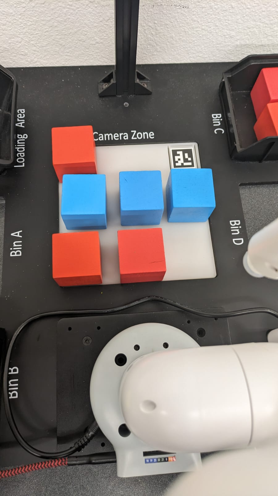

# Tic-Tac-Toe-playing-robot
The project involves a robot equipped with a camera to detect arUco markers, enabling it to determine the relative distance to the arUco board.
Calibration is performed by asking the user to crop the output frame, ensuring accurate colour detection for block placement and preventing mistaken colour detection.
 
The code establishes communication with the robot, creating a robot object to move it to the correct position for picking up and placing blocks.
The video stream is continuously cropped based on a remembered ratio, and a tic-tac-toe board is drawn on the frame to facilitate block placement.
 
The tic-tac-toe board is represented as a 3x3 list, initially filled with empty strings, and updated with 'X' or 'O' based on user and robot moves.
Image flipping is performed as the camera faces the opposite direction of the robot.
 
User input is prompted, and upon pressing the spacebar, the code captures a frame, detects contours of a specific colour (red), and draws rectangles around them.
The code calculates the centre of these rectangles, determines the corresponding row or column on the tic-tac-toe board, and updates the board accordingly.
 
The code employs a defensive strategy, blocking potential wins for the user by calculating its next move.
The robot picks up and places blocks in a predefined location, considering the orientation of the end effector for proper placement.
 
The board is continuously updated, and the current state is displayed on the CV2 frame as a terminal output.
The code checks for win conditions or a full board after each move, printing corresponding text and exiting the program if met.
 
 
[YouTube Link for video explanation of the project](https://www.youtube.com/watch?v=1RMSOqQ_Wi8&ab_channel=YashasKarthik)
